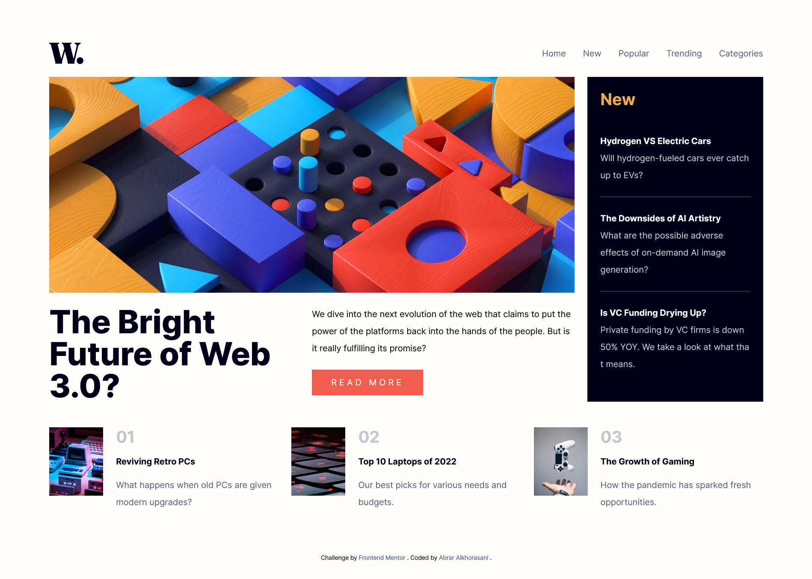

# Frontend Mentor - News homepage solution

This is a solution to the [News homepage challenge on Frontend Mentor](https://www.frontendmentor.io/challenges/news-homepage-H6SWTa1MFl). Frontend Mentor challenges help you improve your coding skills by building realistic projects.

## Table of contents

- [Overview](#overview)
  - [The challenge](#the-challenge)
  - [Screenshot](#screenshot)
  - [Links](#links)
- [My process](#my-process)
  - [Built with](#built-with)
  - [What I learned](#what-i-learned)
  - [Continued development](#continued-development)
  - [Useful resources](#useful-resources)
- [Author](#author)

## Overview

### The challenge

Users should be able to:

- View the optimal layout for the interface depending on their device's screen size
- See hover and focus states for all interactive elements on the page

### Screenshot

### Links

- [Solution URL:](https://github.com/Abrar-Abdulwahed/news-homepage)
- [Live Site URL:](https://abrar-abdulwahed.github.io/news-homepage/)

## My process

### Built with

- Semantic HTML5 markup
- CSS custom properties
- Flexbox
- CSS Grid
- Tailwind Framework
- Mobile-first workflow
- Some accessibility concepts.

### What I learned

Tailwind Framework 🚀

### Continued development

- Add animation to the site

### Useful resources

- [Tailwind Document](https://tailwindcss.com/docs/)

## Author

- Website - [Abrar Alkhorasani](https://www.your-site.com)
- Frontend Mentor - [@Abrar-Abdulwahed](https://www.frontendmentor.io/profile/Abrar-Abdulwahed)
